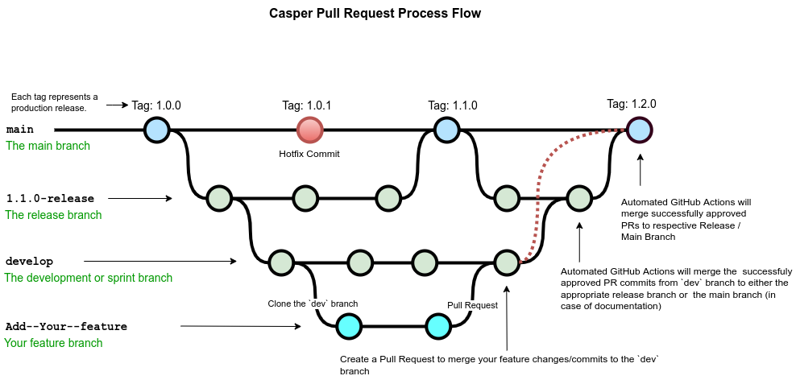

<!-- markdownlint-disable MD033 MD013 -->
# Contributing to Casper - Guideline Document

Welcome! If you are on this page, you are probably interested in contributing to Casper's development, and we are excited to have you here.

Casper truly believes in the strength of community participation and welcomes help in many forms.

We always need help improving documentation, creating tutorials, and writing tests. You can help Casper by participating in development, code review, and documentation improvements.

## Code of Conduct

The Casper [Code of Conduct](https://github.com/casper-network/.github/blob/main/profile/CODE_OF_CONDUCT.md) governs this project and those participating in it. By participating, you are expected to uphold this code.

## How Can I Contribute?

### 1. Reporting Bugs

The Casper Ecosystem and Network consist of repositories specific to the Casper Node, SDKs, Contracts, and Documentation.

If you notice any bugs, please open an issue in the respective repository. You can choose the appropriate template when opening an issue and fill in the requested details.

When creating a bug report, please include as many details as possible. Filling out the required template with the information it asks for helps us resolve issues faster.

#### Before Submitting A Bug Report

- Check the documentation/FAQs for a list of common questions and problems.
- Determine which repository the problem should be reported in.
- Perform a cursory search to see if the problem has already been reported in the respective repository. If it has and the issue is still open, add a comment to the existing issue instead of opening a new one.

> **Note:**
> If you find a closed issue that seems like it is the same thing you're experiencing, open a new issue and include a link to the original issue in the body of your new one.

#### How Do I Submit A (Good) Bug Report?

Bugs are tracked as GitHub issues. After you've determined which repository your bug is related to, create an issue on that repository and provide the following information by filling in the template:

- **Use a clear and descriptive title** for the issue to identify the problem.
- **Describe the exact steps that reproduce the problem** in as much detail as possible.
- **Provide specific examples to demonstrate the steps**. Include links to files or GitHub projects, or copy/paste-able snippets, which you use in those examples. If you're providing snippets in the issue, use Markdown code blocks.
- **Describe the behavior you observed after following the steps**, and point out what exactly is the problem with that behavior.
- **Explain which behavior you expected to see instead and why**.

### 2. Code Contribution

There are several ways to identify an area where you can contribute to Casper.

You can take a look at existing issues in our various repositories to see what you can work on.

If you're interested in working on an issue, we recommend you comment on it so that a maintainer can bring you up to speed, and that others know you are working on it.

If there's something you'd like to work on, but isn't captured by an existing issue, feel free to open an issue within the appropriate public repositories of the [Casper Network](https://github.com/casper-network/) to start the discussion.

If you're looking to collaborate and want to find easy tasks to start, look at the issues we marked as `good first issue`.

You can also start by looking through the `beginner` and `help-wanted` issues.

### 3. Casper Documentation

If you need to add or change anything in Casper Documentation, please raise a PR to the `dev` branch.

> **NOTE:** Kindly check the sample PR/PR Process in the Pull Requests section.

The Casper Writing and Editing Style Guide aims to establish a set of standards and guidelines for writing and editing Casper documents to provide uniformity and consistency throughout.

Please follow the specific Writing Style Guides like [Guidelines](https://github.com/casper-network/docs/blob/dev/writing-style-guide.md#general-guidelines-general-guidelines), [Grammar](https://github.com/casper-network/docs/blob/dev/writing-style-guide.md#grammar-grammar), [Verb Agreement](https://github.com/casper-network/docs/blob/dev/writing-style-guide.md#verb-agreement-verb-agreement), [Headings](https://github.com/casper-network/docs/blob/dev/writing-style-guide.md#headings-headings), [Lists](https://github.com/casper-network/docs/blob/dev/writing-style-guide.md#lists-lists), [Tables](https://github.com/casper-network/docs/blob/dev/writing-style-guide.md#tables-tables), [Images](https://github.com/casper-network/docs/blob/dev/writing-style-guide.md#images-images), and [Formatting](https://github.com/casper-network/docs/blob/dev/writing-style-guide.md#formatting-formatting) used by Casper's documentation team to keep the updates consistent.

Upon successfully submitting the PR, the Casper team will review the PR or reach out accordingly.

### 4. Creating Pull Requests

As a contributor, you are expected to `fork` a repository, work on your own `fork`, and then submit a pull request. The pull request will be reviewed and eventually merged into the `main` repository.

#### Prerequisites:

- Create a fork of the `dev`, `feature`, or `release-feature` branch to which you want to add your changes.

- Please note that the naming convention followed for a Release/Feature branch includes:

  - `release-1.4.6` in case of Major releases (e.g., Protocol release).
  - `feat-1.5.0` in case of Feature releases.

- Clone the forked repository, add code, commit, and push.

- Enable Automated Testing [Refer to GitHub’s [Automating builds and tests - GitHub Docs](https://docs.github.com/en/actions/automating-builds-and-tests) for more information].

- Verify the tests have been automatically run.

  - Add a test that reveals a problem.
    - Open an issue on GitHub.
    - Fix the broken test and proceed to Step 4.2.

- Open a Pull Request.

- The Casper Team will review the Pull Request and accept it if the changes are in line with Casper’s expected code quality, test coverage, and security standards.

  - Git Rules

    - We use `gitchangelog` for all of our repositories for change logs. For that, we need to adhere to the following convention when writing commit messages. Your pull request may not be merged if you are not following this convention.

  - Commit Message Convention
    - The following suggestions might be useful to add to your commit messages. You might want to separate your commits into rough sections:
      - by purpose (for example: new, fix, change...).
      - by the entity (for example: doc, sdk, code...).
      - by the audience (for example: dev, tester, users...).
  
    - Additionally, you might want to tag some commits:
      - as `minor`, for commits that shouldn’t get output to your changelog (cosmetic changes, small typo in comments...).
      - as `refactor`, if you don’t have any significant feature changes.      
      Thus, this should not also be part of the changelog displayed to a final user but might be of some interest if you have a developer changelog.
      - you could also tag with `api` to mark API changes or if it's a new API or similar.

**Casper Pull Request Workflow:**

Please refer to the Casper Pull Request Workflow below;

- Best Practices
  - Code in the Casper project should meet the style guidelines with sufficient test cases, descriptive commit messages, evidence that the contribution does not break any compatibility commitments or cause adverse feature interactions, and evidence of high-quality peer review.
  - Casper recommends small, frequent PRs over large, infrequent ones.
  - When you notice those dependencies, put the fix into a commit of its own, then check out a new branch, and cherry-pick it.
  - Read the PR template prudently and make sure to follow all the instructions.
  - Please pay attention to the maintainer's feedback, as it is a necessary step to keep up with the standards Casper attains.
  - If the feature requires ongoing maintenance (e.g., support for a particular brand of database), we may ask you to accept responsibility for maintaining this feature.

### 5. Testing

If you are interested in testing our documentation, guides, and developer tools, head over to the following pages:

- [Why Build on Casper](https://docs.casper.network/resources/build-on-casper/introduction/).
- [Getting Started with Rust](https://docs.casper.network/developers/writing-onchain-code/getting-started/).
- [Setting up a Local Network with NCTL](https://docs.casper.network/developers/dapps/setup-nctl/).
- [Testing Smart Contracts with NCTL](https://docs.casper.network/developers/dapps/nctl-test/).

We would love to know your insights/feedback from your testing. You can let us know by submitting issues in the respective repositories on GitHub.

3. Enhancement Proposals (CEP)

To propose major changes or enhancements to the Casper Node, we encourage you to submit a Casper Enhancement Proposal (CEP). The CEP process is designed to provide a structured approach to new features, enabling organized discussion and review.

### 6. Submit a Casper Enhancement Proposal (CEP)

1. **Familiarize Yourself**: Review the [CEP README](https://github.com/casper-network/ceps/blob/main/README.md) to understand the process and what is expected in a CEP.
2. **Draft Your Proposal**: Write a draft of your CEP using the provided [template](https://github.com/casper-network/ceps/blob/main/0000-template.md).
3. **Submit a Pull Request**: Open a PR in the [CEP repository](https://github.com/casper-network/ceps) with your proposal. Ensure you follow all guidelines for submission.
4. **Discussion and Review**: The community and maintainers will review your proposal. Be open to feedback and be prepared to make revisions.
5. **Final Decision**: After discussion, the maintainers will decide whether to accept the CEP. If accepted, it will be merged into the repository and implemented as planned.

### 7. Contributing New Projects to Casper Network

This section is specifically created to explain the mandatory requirements that the Community Developers/Teams are required to follow when contributing new projects to the Casper Network.

The contributing team is expected to follow the below Open-Source Software Compliance in accordance with the other Casper-specific contributions and standards outlined in the previous sections of this document.

#### OSS Compliance Checklist

- **Must have**
  - An OSI-approved OSS license (the LICENSE file).
  - README with intro, install, usage, and testing instructions (README.md).

- **Highly Recommended**
  - Repository description (on the top right of the repository, with a proper web link, and relevant topics for discoverability).
  - Code of conduct (CODE_OF_CONDUCT.md).
  - Contribution policy (CONTRIBUTING.md).
  - Security policy (SECURITY.md).

- **Nice to have**
  - Issue templates.
  - PR template.
  - Repository admins accept content reports (enabled from the admin settings of the repository).

## Contributing Style Guide

Please follow the Writing Style Guide used by Casper's Documentation team to ensure consistency across Casper Ecosystem documentation.

[Contributing Documentation](https://github.com/casper-network/docs/blob/dev/writing-style-guide.md)
